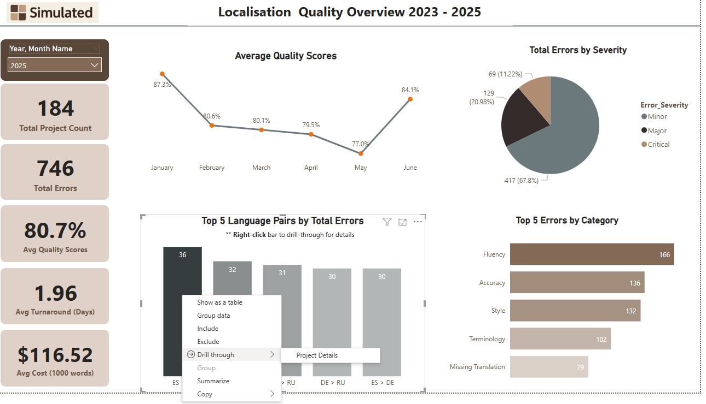

# Rachel’s – Dashboard Portfolio

- **Localisation Quality and Vendor Performance Analysis Project**

Welcome to my portfolio!

I'm Rachel, a data-focused quality lead with **10+ years of experience** in localization, investment data, and strategic insights. This project showcases my strengths in **Power BI development, process improvement, and business intelligence** through the modeling of real-world localization scenarios with simulated data.

## **Project: Localisation Quality and Vendor Performance Analysis**

**Key Information:**

- **Data Source:** All analysis is performed using **simulated and anonymized data**, modeling real-world localization scenarios for demonstration purposes.
- **Objective:** 
To develop a robust Power BI solution that enables comprehensive tracking of vendor and freelancer performance across localization projects, **facilitating the strategic selection of the most cost-efficient, high-quality partners.**

---

### 📌 **Project Overview:**

> This Power BI dashboard provides a detailed evaluation of vendor performance across **cost, quality, and timeliness**. It leverages **weighted error metrics, key performance indicators (KPIs), and interactive visualizations** to offer actionable insights.
> 

🔧 **Tools Used:**

Power BI · DAX · Power Query · Excel · Python

🎯 **Key Features:**

- **Executive KPIs:** At-a-glance cards summarizing total projects, overall cost, average turnaround time, and average quality scores.
- **Error Analysis:** Detailed breakdowns of errors by severity and category, enabling targeted quality improvement initiatives.
- **Performance Trends:** Visualizations to track quality scores and other metrics over time with interactive slicers.
- **Enhanced User Experience:** Implemented dynamic tooltips and a drill-through capability, allowing users to dive from high-level language pair performance to specific project details.
- **Advanced Logic:** Utilized weighted scoring with a penalty factor to accurately quantify quality, reflecting the true impact of different error types.

**Dashboard Pages (Visual Snapshots):**

**Page 1: Localization Quality Overview**

📈

📈

Drill Through Page

**Page 2: Vendor Performance Dashboard**    

 **Page 3: Key Influencers & Deep Dive**   

💡**Key Project Outcomes:** By visualizing vendor-level severity-weighted errors, turnaround time, and cost, I successfully:

- Identified top contributors to quality issues.
- Highlighted the fastest and most cost-effective vendors.
- Developed data-driven recommendations for more strategic vendor allocation and process improvements.

⭐     **Interactive Walkthrough:** Explore the live dashboard interactivity and features in this guided video tour:    

[https://www.loom.com/share/0b8380049dad42da93e7cefb13999f6b?sid=d134b4fe-fb8b-4925-8113-8b3a38c6ff02](https://www.loom.com/share/0b8380049dad42da93e7cefb13999f6b?sid=d134b4fe-fb8b-4925-8113-8b3a38c6ff02)

## ✅ Disclaimer

> This project utilizes **simulated, non-confidential data** for personal learning, portfolio presentation, and demonstration of analytical capabilities.
> 

Feel Free to connect: https://www.linkedin.com/in/rachel-wan-%EF%BC%88%E6%BA%AB%E7%91%9E%E8%8A%AF%EF%BC%89-611208b4/
